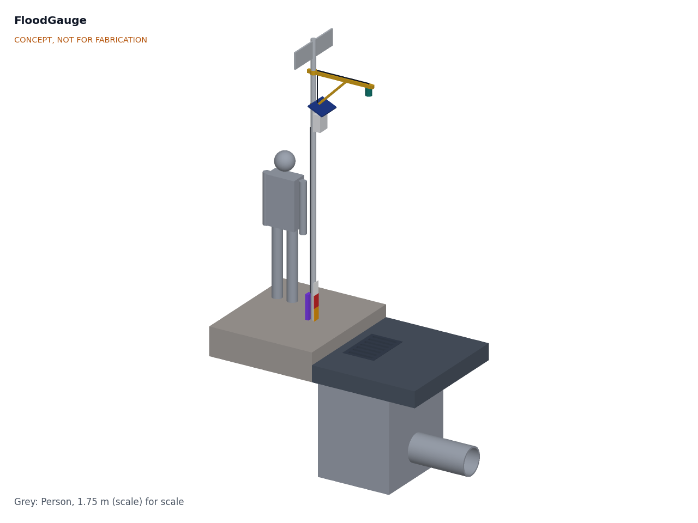
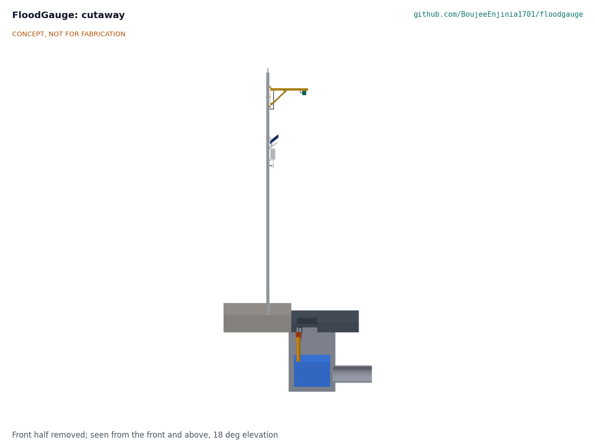
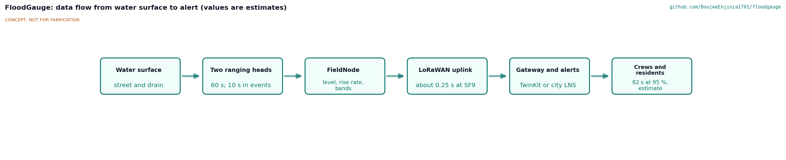
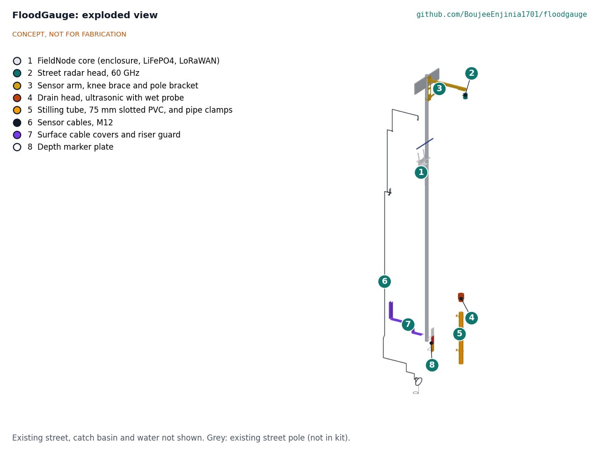
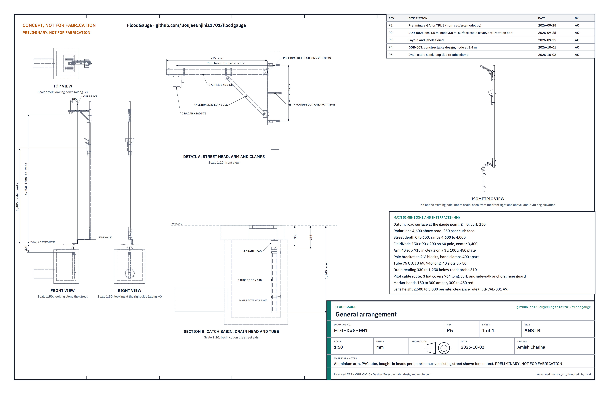

# FloodGauge design precis

## Summary

FloodGauge is a FieldNode core on an existing street pole next to a storm inlet, with two ranging heads: a 60 GHz radar head on a short arm over the gutter that measures water depth on the street, and an ultrasonic head in a slotted stilling tube inside the catch basin that sees the drain filling before the street floods. The node turns ranges into levels, raises its sampling rate when water rises, and sends levels only over LoRaWAN to the partner city's alert service, which decides who acts and warns crews and the residents who opt in, at default depths of 150 mm and 300 mm. FLG-CAL-001 v0.4 gives an alert latency of 82 s at the 95th percentile (110 s worst case), a sensor load under 10 mW and 4.99 kg on the pole. Value-engineering target: USD 160 (set by Amish on 2026-09-26). Estimated cost of the constructable design: USD 205.50 for FloodGauge-specific parts (USD 45.50 over the target); USD 344.50 with the USD 139.00 FieldNode core, which is costed in its own repo. One requirement is not met: installation takes 120 min against 90 min (R12). The design choices below were decided by Amish on 2026-09-25 (FLG-DDR-001 and FLG-DDR-002): the lens sits at 4.6 m to clear tall vehicles, pilots use a surface cable route under bolted steel covers, and an M8 through-bolt stops the arm turning. FLG-DDR-003 (2026-10-01, accepted by Amish on 2026-10-02) makes the design buildable: the arm sits in cleats on a pole bracket with V-blocks and band clamps, the brace is pinned in two clips, the FieldNode sits at 3.4 m, and the drain cable comes up through a grate opening under three hat-section covers. The build plan is FLG-BLD-001.

Figure 1. Concept massing model beside a storm inlet, with a 1.75 m person for scale. CONCEPT, NOT FOR FABRICATION.

## How it works

1. **Range the street.** The street head (item 2) looks straight down at the gutter from 4.6 m, 250 mm past the curb face. The height is set per site within 2.5 to 5.0 m to the road authority's clearance rule; 4.6 m clears a 4.3 m vehicle at the curb with a 0.3 m margin. Water depth is the surveyed head height minus the measured range. The beam also lights the curb, so a dry-road background is recorded at installation and the firmware tracks the peak directly below the head (FLG-CAL-001, A2).
2. **Range the drain.** The drain head (item 4) sits at the top of a slotted 75 mm tube (item 5) fixed to the basin wall. Water in the tube follows the basin level (lag under 5 mm even at 50 mm/s), and the tube walls give the wide ultrasonic beam a clean path, so the head sees the water surface and not the basin walls. A wet probe on the head signals when the basin is full to the head, and an NTC in the head compensates the speed of sound.
3. **Decide on the node.** FieldNode (item 1), mounted 3.4 m above the road so that the street head's I2C cable stays within 3 m along its real route (FLG-DDR-003), samples both heads every 60 s. When either level rises faster than 20 mm/min or passes the first band, it samples every 10 s. It applies plausibility checks: a sudden 1 m "rise" on the street head with an empty drain is a parked vehicle or a person, not a flood.
4. **Report.** Normally one uplink every 15 min; in an event an uplink on each band crossing and then each minute. Payloads carry levels, rate of rise, battery and status only.
5. **Alert.** A gateway (TwinKit or a city LoRaWAN network) passes readings to an open alert service that sends crew notifications and opt-in resident messages and publishes open data.
6. **Check by eye.** A depth marker plate (item 8) with bands at 150 and 300 mm above the road lets residents and crews read depth directly and check the gauge. The alert service adds a first band at 100 mm unless the partner city's own practice says otherwise.

Figure 2. Section across the street through the inlet: street head over the gutter, stilling tube and drain head in the catch basin, surface cable cover to the pole. Water level is illustrative.

Figure 3. Data flow from the water surface to an alert. Values are estimates or proposals.

## Main components

Table 1. Main components (numbers match the exploded view and `bom/bom.csv`)

| # | Component | Decided choice (FLG-DDR-001, FLG-DDR-002) | Notes |
| --- | --- | --- | --- |
| 1 | FieldNode core | Lab shared node: IP65 enclosure, 6 W panel as hood, 6 Ah LiFePO4 cell, MPPT board with 3.3, 5 and 12 V switched rails, STM32WL-class LoRaWAN, two M12 sensor ports | Built to FND-BLD-001; center 3.4 m above the road, facing the street; 2.45 kg and $139.00 |
| 2 | Street radar head | 60 GHz pulsed coherent radar module (Acconeer XM125 class) behind a PTFE lens in a sealed IP67 housing | D3; accuracy, current and price not yet checked against a data sheet |
| 3 | Sensor arm and pole bracket | 40 x 40 x 1.6 mm aluminium tube 715 mm in two angle cleats on a 3 mm pole bracket plate with two V-blocks and two band clamps 400 mm apart; 25 mm square knee brace at 45° pinned in two clips; head plate; M8 anti-rotation through-bolt across the street through the plate and the pole | Head 250 mm past the curb face over the gutter (D5); lens 4.6 m, per site 2.5 to 5.0 m (DDR-002) |
| 4 | Drain head | Waterproof ultrasonic ranger (A02YYUW: 3 to 450 cm, ±1 cm, IP67) with a two-electrode wet probe and an NTC, potted in a sealed cap | Face 300 mm below the road; the transducer face keeps its IP67 seal, so R9 is at risk |
| 5 | Stilling tube | 75 mm OD PVC, 940 mm long, 40 slots 5 x 50 mm, two stainless stand-off pipe clamps, mouth 60 mm above the basin floor; the drain head's socket slides over its top | Reachable from the surface with the grate lifted; the drain cable has a 0.5 m slack loop tied to the upper pipe clamp so it cannot catch debris |
| 6 | Sensor cables | Two outdoor cables with M12 5-pin plugs to the FieldNode ports: 3 m (street, I2C) and 5 m (drain) | Drip loops at every entry |
| 7 | Surface cable covers | Pilot route: up through the grate opening nearest the curb, under three bolted hat-section covers of 2 mm galvanized steel (gutter strip, curb face, sidewalk; 0.76 m in all) and up a riser guard strapped to the pole | Anchors in the curb and sidewalk only, with security (snake-eye) nuts; permanent sites use a 25 mm conduit laid with road works (DDR-002) |
| 8 | Depth marker plate | 2 mm aluminium plate from 165 mm above the road, amber band to 300 mm and red band 300 to 450 mm above road level, on two band clamps with pin-Torx security screws that also hold the riser guard | Visual check and resident information |
| 9 | Alert service | Open software on the gateway or a small server (not modeled) | Part of the software license (MIT) |

Figure 4. Exploded view with BOM numbers. The existing street and basin are not shown.

## First-order numbers

The values below are from FLG-CAL-001 v0.4 and its script, on the constructable design of FLG-DDR-003.

Table 2. Key numbers at TRL 3

| Quantity | Value | Basis | Requirement |
| --- | --- | --- | --- |
| Street head range | 4.60 m to dry road, 4.00 m at 600 mm depth; 1.9 to 5.0 m over the R1 band | Lens 4.6 m above the road | R1 met on paper |
| Street depth error, radar | ±6.5 mm root sum square, ±12.0 mm worst-case sum | Module ±2 mm (assumed), datum ±5 mm, pole expansion ±2.0 mm, ripple ±3 mm | R2 met on paper |
| Street depth error, ultrasonic variant | +349 to -231 mm uncompensated over -20 to 50 °C; ±27.0 mm compensated | Speed of sound 331.3 + 0.606 T m/s | R2 not met by this variant |
| Drain level error | ±11.0 mm with the NTC, ±19.7 mm without | ±10 mm module ([DFRobot](https://www.dfrobot.com/product-1935.html)), 950 mm range | R4 met on paper |
| Drain reading range | 50 mm above the floor to 330 mm below the road; wet probe at 310 mm | Head face 300 mm below the road, 30 mm blind zone | R3 (restated) met on paper |
| Energy per sampling cycle | 85.1 mJ | Radar 59.4 mJ, ultrasonic 12.0 mJ, rails 90 %, controller 5.8 mJ | |
| Sensor load | 1.42 mW at 60 s; 9.3 mW with 10 s sampling and 1 min uplinks all day | 1,440 or 8,640 cycles a day | R8 met: 68 days without sun |
| Uplink airtime | 23.7 s/day normal at SF9; 14.8 s/h in an event | 246.8 ms per 20-byte uplink | R7 at risk at SF11 and SF12 |
| Alert latency | 82 s at the 95th percentile, 110 s worst case without a lost packet | Simulation of 200,000 events | R6 met on paper |
| Arm twist | Factor 37 with the M8 through-bolt; 1.45 on clamp friction alone | 35 m/s gust along the street | R15 met on paper |
| Installation | 120 min, surface only, no civil work | Task list in FLG-CAL-001, L1 | R12 met on paper (120 min for the pilot route) |
| Mass on the pole | 4.99 kg | FieldNode 2.45 kg plus arm, bracket, bolts, head, cables and marker (FLG-CAL-001 v0.4) | R15 met on paper (0.01 kg margin) |
| Parts cost | $205.50 FloodGauge-specific; $344.50 with FieldNode | `bom/bom.csv` | R16: value-engineering target USD 160; estimated cost of the constructable design USD 205.50 (USD 45.50 over the target) |

Figure 5. General arrangement FLG-DWG-001, Rev P4, from `cad/src/model.py`. PRELIMINARY, NOT FOR FABRICATION.

## Key design choices

Decided by Amish, 2026-09-25: go with recommendation (FLG-DDR-001, D1 to D9, and FLG-DDR-002, N1 to N5).

1. **Two heads on one node** (street and drain), because each head misses one of the two ways streets flood (FLG-PRB-001). Street head only remains the fallback where no cable route to the basin exists. (D2)
2. **Radar for the street head.** FLG-CAL-001 confirms that a compensated ultrasonic head misses R2 (±19.5 mm). The ultrasonic head stays documented as a lower-cost variant. (D3)
3. **Ultrasonic in a stilling tube for the drain,** with the wet probe as a second signal and an NTC for temperature. (D4)
4. **Arm over the gutter,** lens height set per site within 2.5 to 5.0 m to the road authority's clearance rule; 4.6 m in the reference design, where tall vehicles use the curb lane. The arm carries an M8 through-bolt so wind cannot turn it. (D5; DDR-002 N2 and N4)
5. **Alert bands at 150 mm and 300 mm** above the road ([NWS](https://www.weather.gov/safety/flood-turn-around-dont-drown)), plus a drain-full alert from the wet probe, as defaults to be set with the partner city. In a fast flood the 150 mm band warns at about 190 to 250 mm (FLG-CAL-001, F3), so the alert service also supports a first band below 150 mm, set at 100 mm unless the partner's own practice says otherwise (decided 2026-10-02). (D6; DDR-002 N5)
6. **Private or city LoRaWAN gateway for event reporting** (TwinKit or the city network), with The Things Network for pilots only. (D7)
7. **Levels only, no imaging.** (D8)
8. **Surface cable route for pilots,** under a bolted steel cover anchored to the curb and sidewalk, with the conduit kept for permanent sites laid with road works. (DDR-002 N3)

The FieldNode core is costed in its own repo, and R16 covers FloodGauge-specific parts only (D1). The pitch and problem lines are unchanged (D9).

## Safety

> **Safety:** Work beside live traffic. Install only with the road and pole owner's permission, with traffic management and high-visibility clothing as local rules require.
>
> **Safety:** Catch basins are confined spaces that can hold toxic or oxygen-poor air and fast-rising water. The design is installed from the surface; never enter a basin. Lifting a grate can crush fingers and strain backs; use a grate hook and two people. Stormwater carries sewage and chemicals: wear gloves and eye protection and wash after work.
>
> **Safety:** Work at height on the pole needs a mobile elevating platform for the arm at 4.7 m, a second person and clearance from overhead power lines. Drilling the pole for the anti-rotation bolt needs the asset owner's permission.
>
> **Safety:** An arm over the gutter can be struck by trucks, buses or their mirrors at the curb if it is too low (FLG-CAL-001, A7). Mount it at the height the road authority requires (4.6 m in the reference design) and always fit the anti-rotation through-bolt so that wind cannot swing it over the traffic lane.
>
> **Safety:** The surface cable cover crosses the sidewalk. Keep it low and beveled, anchor it firmly and mark it so that it is not a trip hazard.
>
> **Safety:** FieldNode holds a LiFePO4 cell of about 19 Wh. Fuse it, charge only between 0 and 45 °C, and never install a swollen, damaged or wet cell.
>
> **Safety:** FloodGauge supplements official warnings and must never be presented as the only warning. A dead battery, a blocked tube or a lost radio link can hide a flood. The alert service must report when a gauge goes silent. The partner city's emergency management office owns the alerts and decides who acts; FloodGauge publishes levels and band crossings only and holds no resident contact data.

## Open questions

- [ ] Radar module accuracy, current draw, beam width with the lens, price and radio certification for fixed outdoor use at 60 GHz in the pilot country (assumed in FLG-CAL-001).
- [x] Pilot partner: a city or county flood agency with street flooding at grated curb inlets and an existing gauge or alert programme; the first candidate type to approach is a county flood control district such as the Harris County Flood Control District (decided 2026-10-02; nothing agreed).
- [ ] Whether the surface cable cover survives street cleaning, snow ploughs and parked-car wheels at the curb.
- [ ] Silt and debris in the stilling tube: slot size, cleaning interval, and whether the tube clogs in the first storm.
- [ ] Plausibility logic for vehicles, people, snow and floating debris under the street head.
- [x] Theft and vandalism: tamper-resistant screw heads and nuts on everything within reach of the sidewalk (marker bands, covers, riser guard and anchors) for the pilot; the node stays at 3.4 m (decided 2026-10-02).
- [x] Alert governance: the partner city's emergency management office owns the alerts; FloodGauge publishes levels and band crossings only, the city decides who acts, and residents opt in and out through the city's existing alert channel, so the project holds no resident contact data (decided 2026-10-02).
- [ ] Datum survey method and how often to recheck it.
