# FloodGauge prototype build plan

**Plan, not yet built.** How to build the first proof-of-concept prototype, component by component. Building and testing to it is TRL 4 work. Decisions still to be made are kept in the design decisions register ([docs/06-design-decisions.md](06-design-decisions.md)), not here.

## 1. What you are building

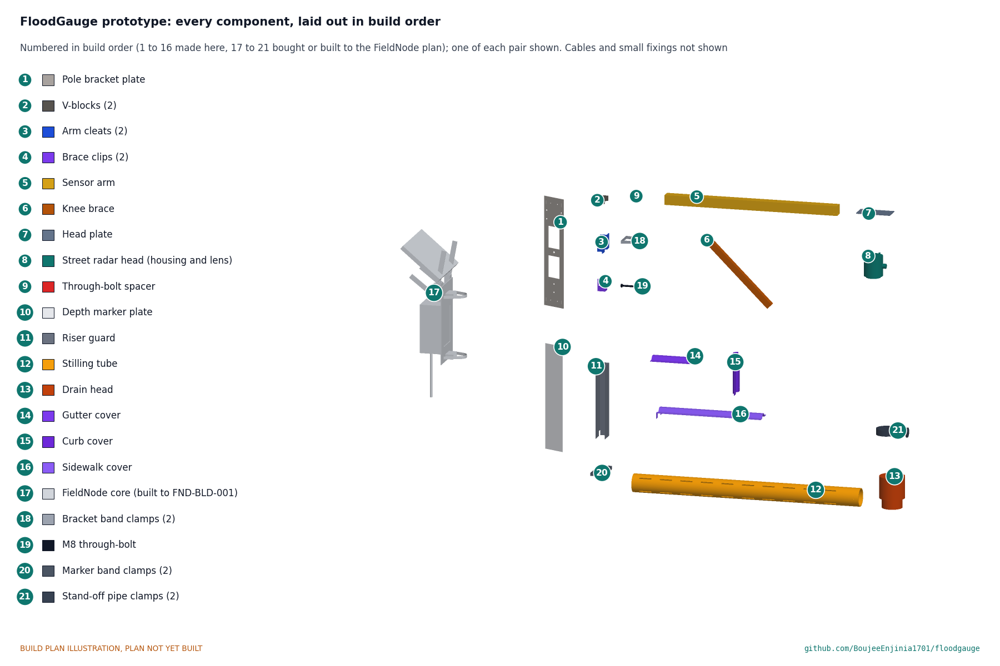

*Figure 1. Every component, numbered in build order; one of each pair is shown.*

The prototype is one FloodGauge on a street pole beside a storm inlet. A radar head hangs from an aluminium arm over the gutter, 4.6 m above the road; the arm is bolted to a bracket plate that clamps to the pole. A FieldNode core, built to its own plan (FND-BLD-001), sits on the pole 3.4 m up and does the sensing, power and radio. In the catch basin, a slotted plastic tube hangs on two pipe clamps with an ultrasonic drain head on top, and its cable comes up through the grate and runs under three bolted steel covers to the pole. A depth marker plate and a riser guard sit at the foot of the pole. Figure 1 shows the 21 components: 16 are made in a small workshop (aluminium plate, bar, angle and tube cut, drilled and folded; steel strip folded; PVC pipe slotted; two heads assembled from bought parts), and the rest are bought or built to the FieldNode plan. The FloodGauge-specific parts cost about $205.50 from the bill of materials.

> **Safety:** The installation is work beside live traffic, at height on a pole and over an open catch basin. Never enter a catch basin: it can hold toxic or oxygen-poor air and fast-rising water. The arm goes up from a mobile elevating platform with a second person, clear of overhead lines. Stormwater carries sewage and chemicals: wear gloves and eye protection. The FieldNode holds a lithium iron phosphate cell of about 19 Wh: follow the FieldNode plan's safety stops. Cut aluminium and steel edges are sharp; deburr everything. FloodGauge supplements official warnings and is never the only one.

## 2. What changed to make it buildable

The concept showed what the gauge does; some of its parts passed through each other or had no fixing. Each change below keeps what the gauge does, and all of them are recorded in decision record FLG-DDR-003, accepted by Amish on 2026-10-02.

*Table 1. Changes from the concept.*

| Component | The concept had | The buildable design has | Why |
| --- | --- | --- | --- |
| Arm to pole | An arm that ran through the pole, inside two plain rings | A bracket plate on two V-blocks and two band clamps; the arm held between two angle cleats on the plate (Figures 2, 4, 6) | The arm and the pole no longer occupy the same space, and the clamps can be tightened |
| Knee brace | A brace touching the arm and floating at the pole end | A brace pinned in two folded clips, one under the arm and one on the plate (Figures 10, 11) | Each end has a fixing |
| Anti-rotation bolt | An M8 bolt through a band clamp, along the street | An M8 bolt across the street through the plate, a spacer and the pole (Figure 11) | A band clamp cannot take a bolt |
| Radar head fixing | A block that sat inside the head | A head plate under the arm; the housing hangs from it on four screws (Figure 13) | The block and the head occupied the same space |
| Street cable | Straight up from the head through the arm | A side gland; the cable runs along the arm and down the pole (step 10) | The cable passed through the arm |
| FieldNode | A box on a thick plate with no fixing, at 3.0 m | The FieldNode as built to its own plan, at 3.4 m (step 7) | Its fixing; and the street cable fits its 3 m length on the real route |
| Drain cable exit | Out between the grate and its frame | Up through the grate opening nearest the curb (Figure 25) | The 5 mm gap cannot pass a 10 mm cable |
| Surface cover | An angle with no fixing; a riser guard 250 mm from the pole | Three bolted hat-section covers and a riser guard strapped to the pole (Figures 17, 24) | Every piece has a fixing and the cable is covered all the way |
| Stilling tube | Brackets set into the basin wall | Two stand-off pipe clamps (Figure 21) | Bought, adjustable, fitted from the surface |
| Drain head | Resting on the tube | A socket under the head that slides over the tube, two screws (Figure 21) | It cannot fall off, and it lifts off for cleaning |
| Depth marker | A 3 mm plate with no fixing, from the sidewalk up | A 2 mm plate from 15 mm above the sidewalk, on two band clamps (Figure 17) | The cover passes under it; saves weight |
| Arm and brace walls | 2.0 mm | 1.6 mm, with two windows in the bracket plate | Keeps the mass on the pole under 5 kg after the added parts |

## 3. Making the components

Make and check each component before the assembly step that needs it. Sizes are in millimetres. "Toward the road" and "toward the pole" describe where each face ends up. Workshop tolerance is 0.5 mm unless a step says otherwise; drawings do not carry tolerances before TRL 4.

### 3.1 Pole bracket plate

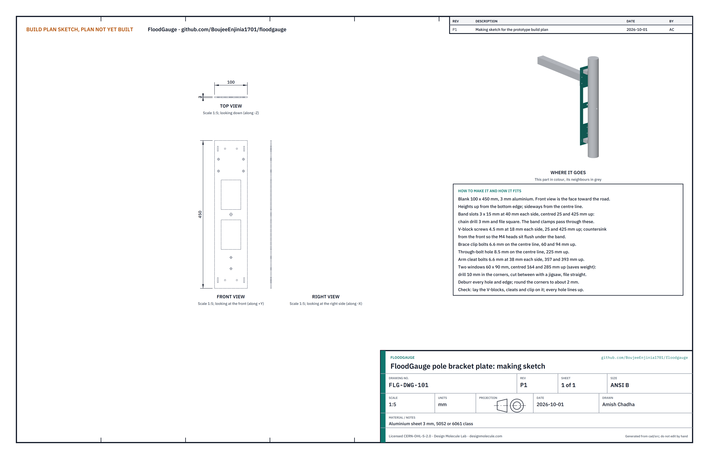

*Figure 2. Pole bracket plate making sketch (FLG-DWG-101).*

**What it is and what it is made from.** The flat plate that carries the arm and brace and clamps to the pole. Aluminium sheet 3 mm thick, 5052 or 6061 class, 100 x 450 mm.

**How to make it.**

1. Cut the blank 100 x 450 mm, square. Scribe a centre line down its length. Choose one face as the front (toward the road).
2. Measure every height up from the bottom edge and every sideways position from the centre line.
3. Band slots: four slots 3 wide and 15 tall, 40 each side of centre, centred 25 and 425 up. Chain drill 3 mm and file square.
4. V-block screw holes: four 4.5 mm holes, 18 each side of centre, 25 and 425 up. Countersink them from the front so the M4 heads sit flush.
5. Brace clip holes: two 6.6 mm holes on the centre line, 60 and 94 up.
6. Through-bolt hole: one 8.5 mm hole on the centre line, 225 up.
7. Arm cleat holes: four 6.6 mm holes, 38 each side of centre, 357 and 393 up.
8. Windows: two 60 x 90 mm windows on the centre line, centred 164 and 285 up. Drill 10 mm in each corner, cut between with a jigsaw and a metal blade, file straight.
9. Deburr every hole and edge and round the corners to about 2 mm.

**How it fits the parts next to it.** The V-blocks sit flat on its back at the two band heights (Figure 4); the cleats and the foot clip sit flat on its front (Figures 6 and 11); the band clamps pass through its slots and across its front; the through-bolt passes its centre hole.

**Check before moving on.** Lay the V-blocks, cleats and a clip on it and look through each hole: every hole lines up without forcing a bolt.

### 3.2 V-blocks (make 2)

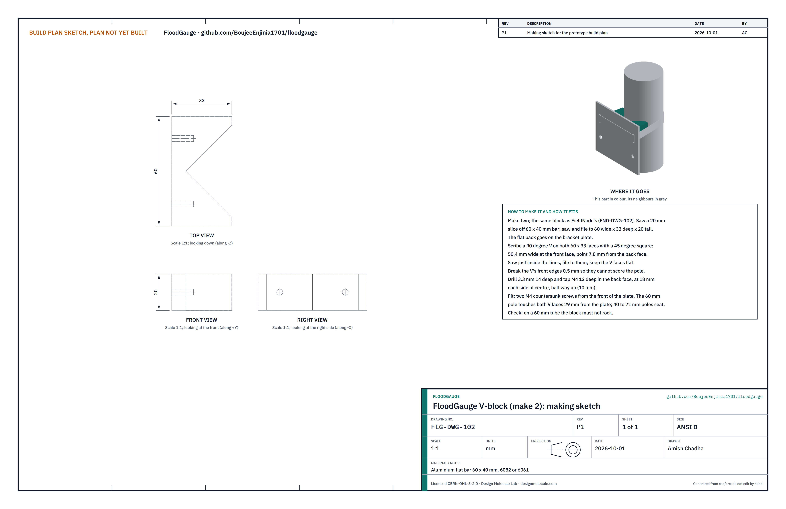

*Figure 3. V-block making sketch (FLG-DWG-102). The same block as FieldNode's.*

**What it is and what it is made from.** A block with a V cut in it that seats the round pole, one at each band clamp. Aluminium flat bar 60 x 40 mm, 6082 or 6061 class.

**How to make it.**

1. Saw two slices 20 thick off the bar; saw and file each to 60 wide, 33 deep and 20 tall. The 60 x 20 face that sits on the plate is the back face; file it flat.
2. On each 60 x 33 face, scribe the V with a 45° square: two lines 50.4 apart at the front face, meeting 7.8 from the back face, centred.
3. Saw just inside the lines and file to them; keep both V faces flat and square.
4. Break the V's front edges by 0.5 mm.
5. In the back face, 18 each side of centre and 10 up, drill 3.3 mm 14 deep and tap M4 12 deep.

**How it fits the parts next to it.**

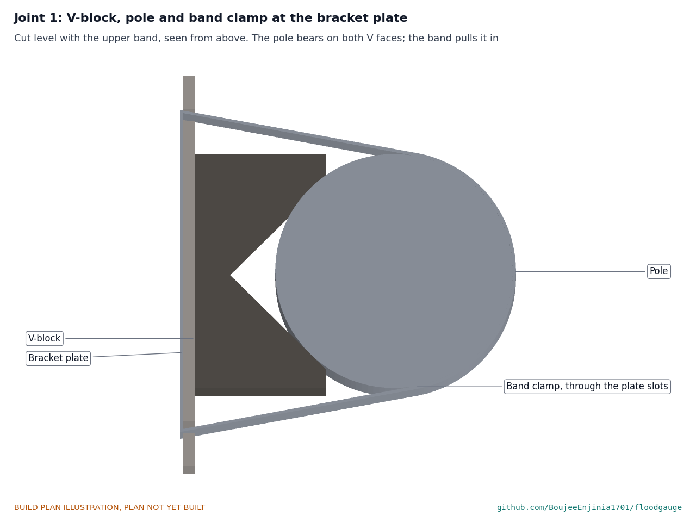

*Figure 4. The pole bears on both faces of the V; the band clamp goes round the pole, through the plate slots and across the plate front, and pulls the pole into the V.*

The back face sits flat on the back of the plate, held by two M4 countersunk screws from the front of the plate with medium threadlocker. The 60 mm pole touches both V faces 29 mm from the plate and never the bottom of the V. Poles from 40 to 71 mm also seat on both faces. The band passes 3 mm clear of the block's corners.

**Check before moving on.** Held against a 60 mm tube, the block does not rock; light shows at the bottom of the V but not along its faces.

### 3.3 Arm cleats (make 2, a left and a right)

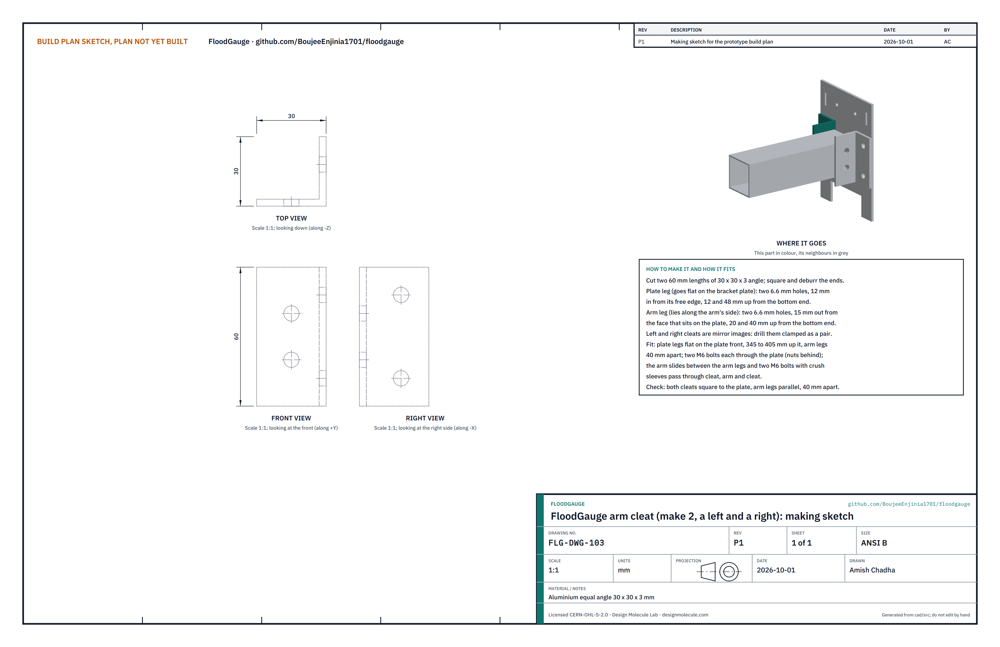

*Figure 5. Arm cleat making sketch (FLG-DWG-103).*

**What it is and what it is made from.** A short angle on each side of the arm that joins it to the bracket plate. Aluminium equal angle 30 x 30 x 3 mm.

**How to make it.**

1. Cut two 60 lengths; square and deburr the ends.
2. Plate leg: two 6.6 mm holes, 12 in from the leg's free edge, 12 and 48 up from the bottom end.
3. Arm leg: two 6.6 mm holes, 15 out from the face that sits on the plate, 20 and 40 up from the bottom end.
4. The two cleats are mirror images: clamp them back to back and drill them together.

**How it fits the parts next to it.**

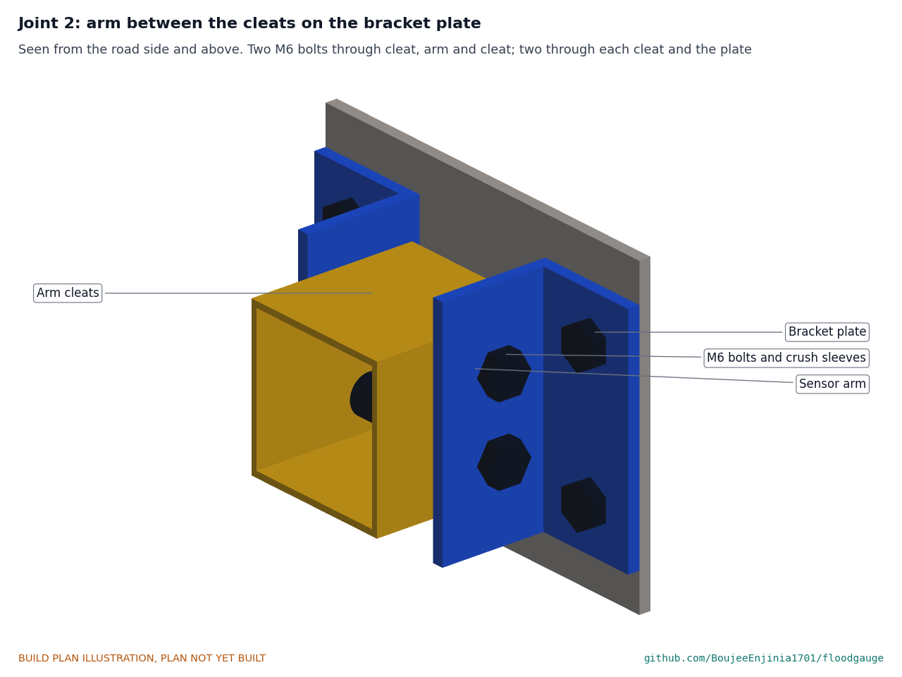

*Figure 6. The arm end sits between the two arm legs, 2 mm short of the plate; four M6 bolts hold the cleats to the plate and two M6 bolts with crush sleeves pass through cleat, arm and cleat.*

The plate legs lie flat on the front of the bracket plate, 345 to 405 up it, with the arm legs standing forward 40 apart. Two M6 bolts per cleat through the plate, nyloc nuts behind.

**Check before moving on.** Both arm legs are square to the plate and 40 apart along their whole length.

### 3.4 Brace clips (make 2)

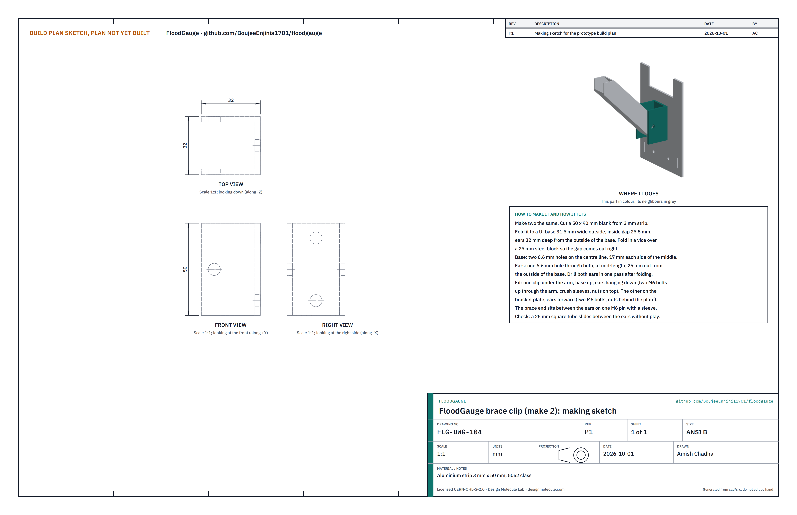

*Figure 7. Brace clip making sketch (FLG-DWG-104).*

**What it is and what it is made from.** A folded U that holds one end of the knee brace on a pin. Aluminium strip 3 mm, 50 wide.

**How to make it.**

1. Cut two 50 x 90 blanks.
2. Fold each to a U over a 25 mm steel block in the vice: inside gap 25.5, base 31.5 wide outside, ears 32 deep measured from the outside of the base.
3. Base: two 6.6 mm holes on the centre line, 17 each side of the middle.
4. Ears: one 6.6 mm hole through both, at mid-length, 25 out from the outside of the base. Drill both ears in one pass after folding so the holes line up.

**How it fits the parts next to it.** One clip goes under the arm with its ears hanging down; two M6 button-head bolts go up from inside the clip through the arm (crush sleeves inside), nyloc nuts on top (Figure 10). The other goes on the bracket plate with its ears pointing toward the road; two M6 button-head bolts through the plate, nuts behind (Figure 11). The brace end sits between the ears on one M6 pin with a sleeve.

**Check before moving on.** A 25 mm square tube slides between the ears without play.

### 3.5 Sensor arm

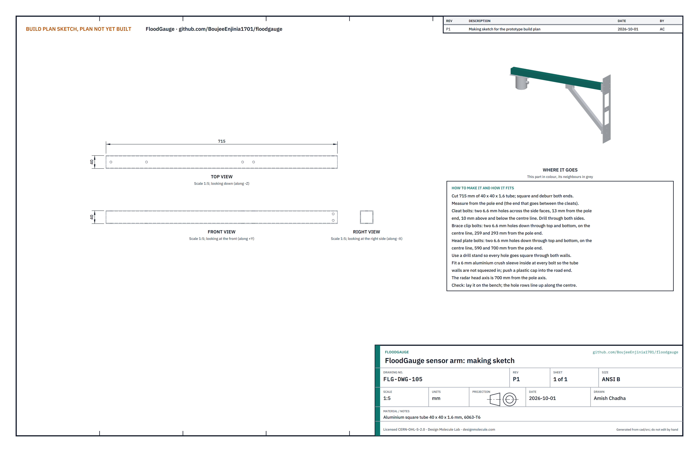

*Figure 8. Sensor arm making sketch (FLG-DWG-105).*

**What it is and what it is made from.** The horizontal arm that holds the radar head over the gutter. Aluminium square tube 40 x 40 x 1.6 mm, 6063-T6.

**How to make it.**

1. Cut 715 of tube; square and deburr both ends. Measure from the pole end.
2. Cleat bolts: two 6.6 mm holes through both side faces, 13 from the pole end, 10 above and below the centre line.
3. Brace clip bolts: two 6.6 mm holes down through top and bottom on the centre line, 259 and 293 from the pole end.
4. Head plate bolts: two 6.6 mm holes down through top and bottom on the centre line, 590 and 700 from the pole end.
5. Drill in a stand so every hole is square through both walls. Push a plastic end cap into the road end.

**How it fits the parts next to it.** Between the cleats at the pole end (Figure 6), the top brace clip underneath (Figure 10) and the head plate underneath at the road end (Figure 13). A 6 mm aluminium crush sleeve goes inside at every bolt so the walls are not squeezed. The radar head's axis is 700 from the pole axis.

**Check before moving on.** The holes line up along the centre line when the arm lies on the bench.

### 3.6 Knee brace

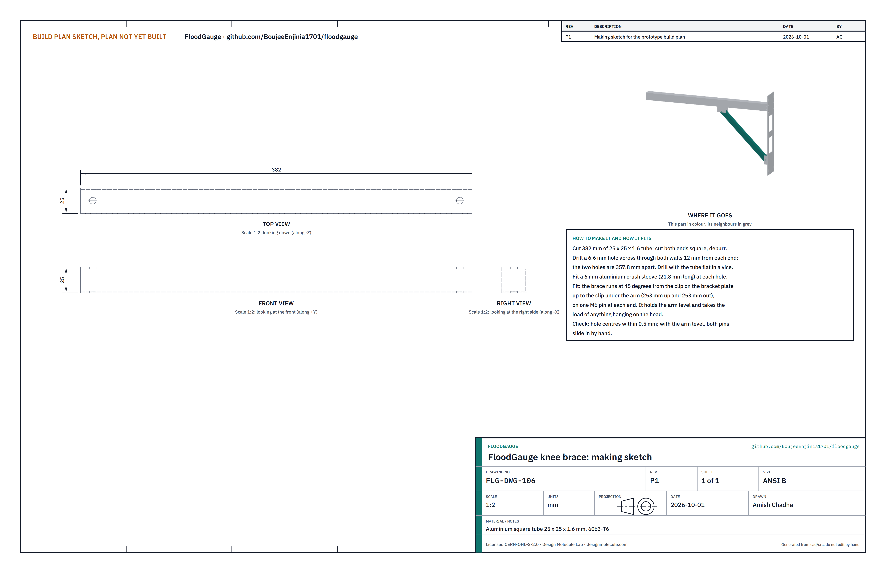

*Figure 9. Knee brace making sketch (FLG-DWG-106).*

**What it is and what it is made from.** The diagonal tube under the arm that holds it level and takes any load hung on the head. Aluminium square tube 25 x 25 x 1.6 mm, 6063-T6.

**How to make it.**

1. Cut 382 of tube; cut both ends square and deburr.
2. Drill a 6.6 mm hole through both side walls 12 from each end: 357.8 between centres. Hold the tube flat in a vice and drill both holes from the same face.
3. Fit a crush sleeve 21.8 long at each hole.

**How it fits the parts next to it.**

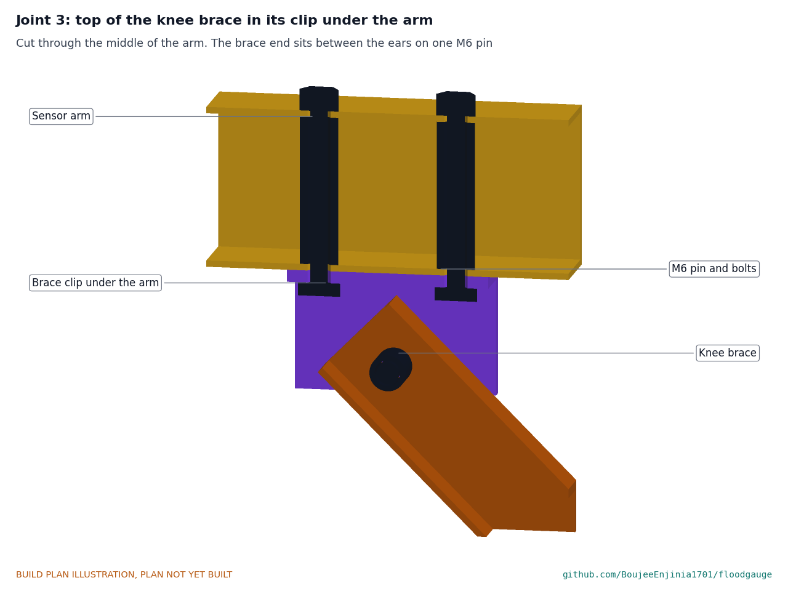

*Figure 10. Cut through the middle: the brace end sits between the ears of the clip under the arm on one M6 pin.*

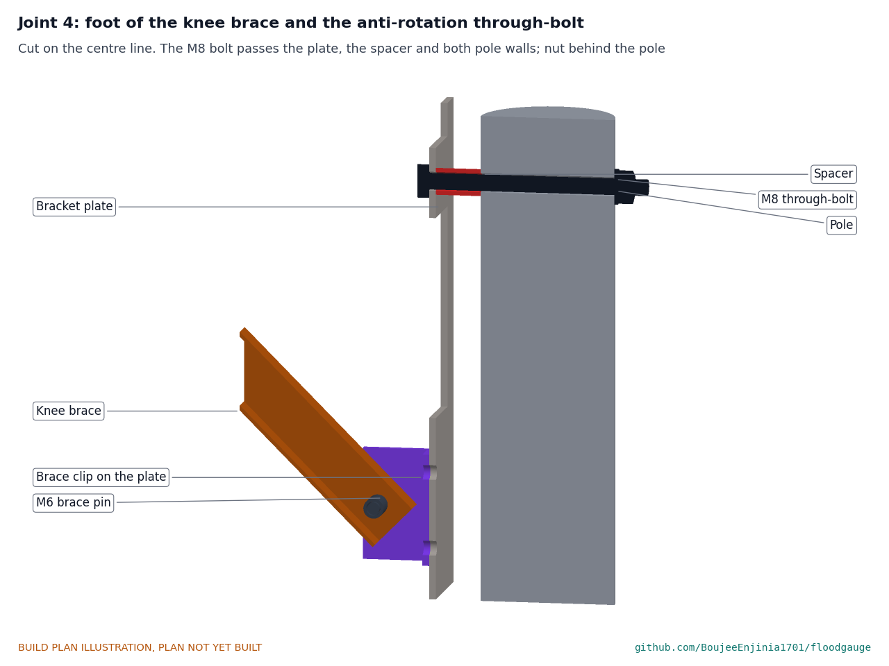

*Figure 11. Cut through the middle: the brace foot pinned in the clip on the plate; above it the M8 through-bolt passes the plate, the spacer and both walls of the pole.*

The brace runs at 45°, 253 up and 253 out between its pins.

**Check before moving on.** With the arm level, both pins slide in by hand.

### 3.7 Head plate

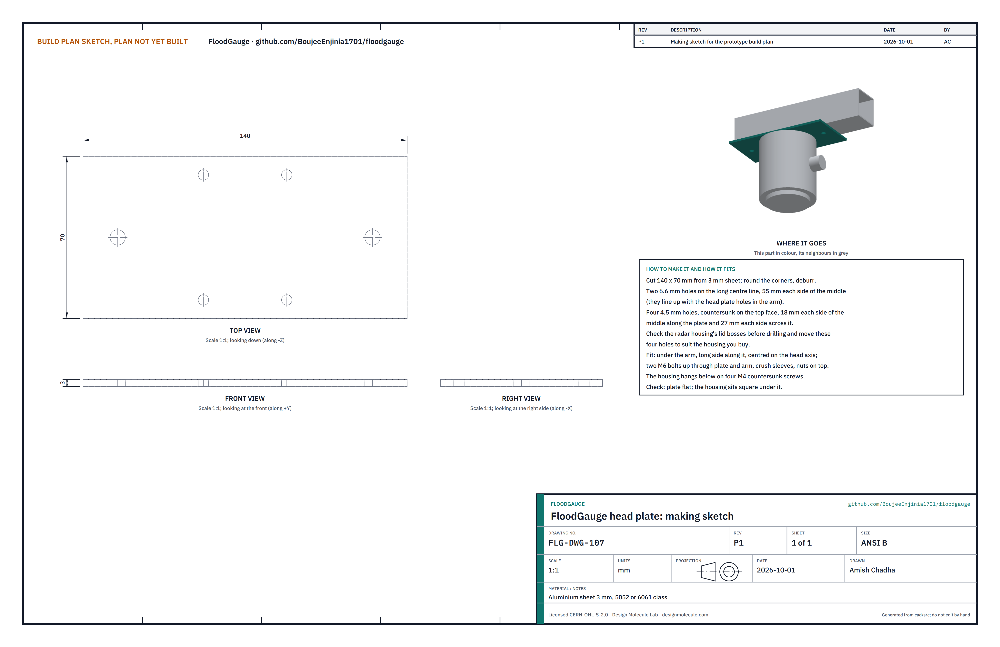

*Figure 12. Head plate making sketch (FLG-DWG-107).*

**What it is and what it is made from.** The plate under the arm that the radar housing hangs from. Aluminium sheet 3 mm, 140 x 70 mm.

**How to make it.**

1. Cut 140 x 70; round the corners and deburr.
2. Two 6.6 mm holes on the long centre line, 55 each side of the middle.
3. Four 4.5 mm holes countersunk on the top face, 18 each side of the middle along the plate and 27 each side across it. Check them against the housing's lid bosses first and move them to suit.

**How it fits the parts next to it.**

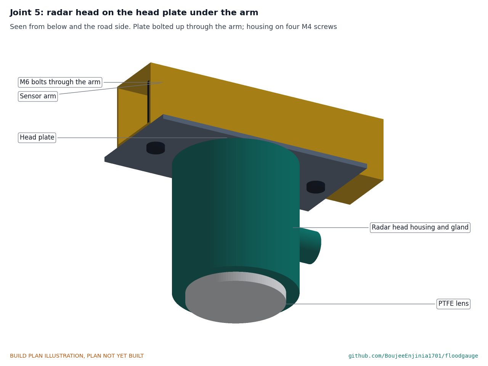

*Figure 13. The head plate is bolted up through the arm; the housing hangs on four M4 countersunk screws; the gland faces the pole.*

Long side along the arm, centred on the head axis; two M6 bolts up through the plate and the arm with crush sleeves, nuts on top.

**Check before moving on.** The plate is flat and the housing sits square under it.

### 3.8 Street radar head

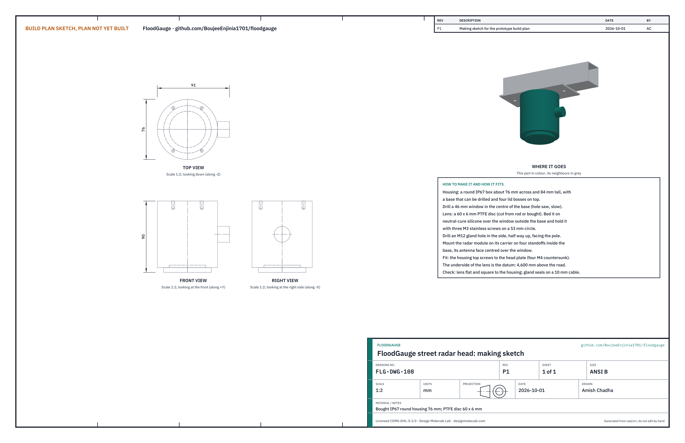

*Figure 14. Street radar head making sketch (FLG-DWG-108).*

**What it is and what it is made from.** The 60 GHz radar module in a round IP67 housing about 76 across and 84 tall, looking down through a PTFE lens disc 60 x 6.

**How to make it.**

1. Drill a 46 mm window in the centre of the housing base with a hole saw at low speed.
2. Bed the lens disc on neutral-cure silicone over the window, outside the base, and hold it with three M3 stainless screws on a 53 mm circle.
3. Drill an M12 gland hole in the side, half way up; fit the gland.
4. Mount the radar module on its carrier on four standoffs inside, its antenna face centred over the window. Wire it to the cable through the gland as its datasheet shows.

**How it fits the parts next to it.** The housing top screws to the head plate (Figure 13) with the gland facing the pole. The underside of the lens is the depth datum: 4,600 above the road.

**Check before moving on.** The lens is flat and square to the housing; the gland seals on the 10 mm cable.

### 3.9 Through-bolt spacer

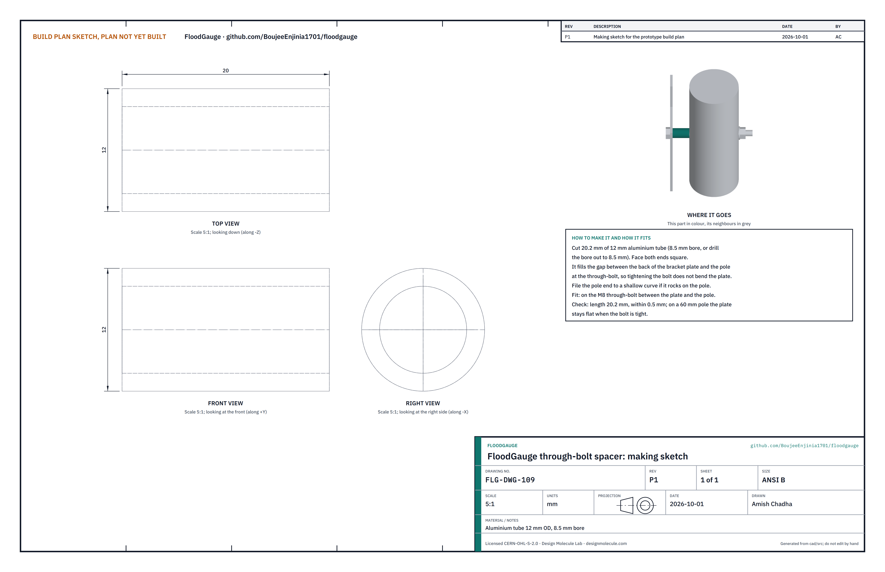

*Figure 15. Spacer making sketch (FLG-DWG-109).*

**What it is and what it is made from.** A short tube that fills the gap between the back of the bracket plate and the pole at the through-bolt. Aluminium tube 12 mm outside, 8.5 mm bore.

**How to make it.** Cut 20.2 long and face both ends square. File the pole end to a shallow curve if it rocks on the pole.

**How it fits the parts next to it.** On the M8 through-bolt between the plate and the pole (Figure 11), so tightening the bolt does not bend the plate.

**Check before moving on.** Length 20.2, within 0.5.

### 3.10 Depth marker plate

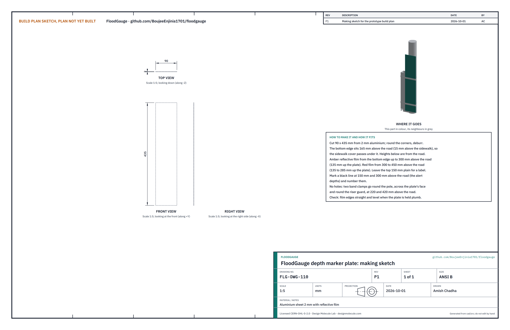

*Figure 16. Depth marker making sketch (FLG-DWG-110).*

**What it is and what it is made from.** The plate on the road face of the pole that lets anyone read the water depth. Aluminium sheet 2 mm, 90 x 435 mm, with reflective film.

**How to make it.**

1. Cut 90 x 435; round the corners and deburr.
2. The bottom edge will sit 165 above the road. Apply amber film from the bottom edge to 135 up the plate (300 above the road) and red film from 135 to 285 up the plate (300 to 450 above the road). Leave the top 150 plain for a label.
3. Mark black lines at 150 and 300 above the road (the alert depths) and number them.

**How it fits the parts next to it.**

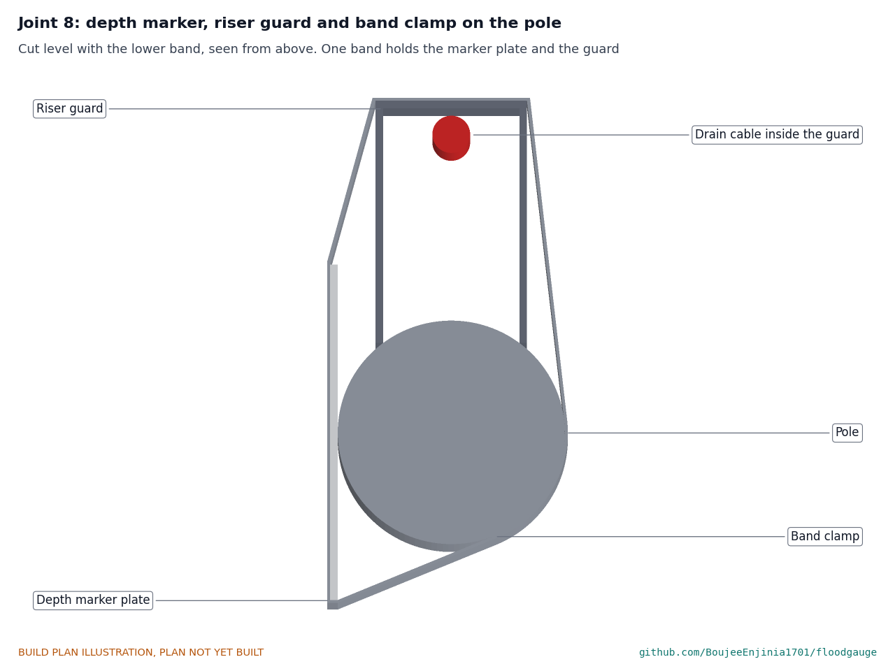

*Figure 17. Seen from above at the lower band: one band clamp goes round the pole, across the face of the marker plate and round the riser guard.*

Flat on the road face of the pole, held by two band clamps at 220 and 420 above the road that also hold the riser guard. Fit the clamps with their security (pin-Torx) screws, tightened with the pin-Torx bit.

**Check before moving on.** The film edges are straight and level when the plate is held plumb.

### 3.11 Riser guard

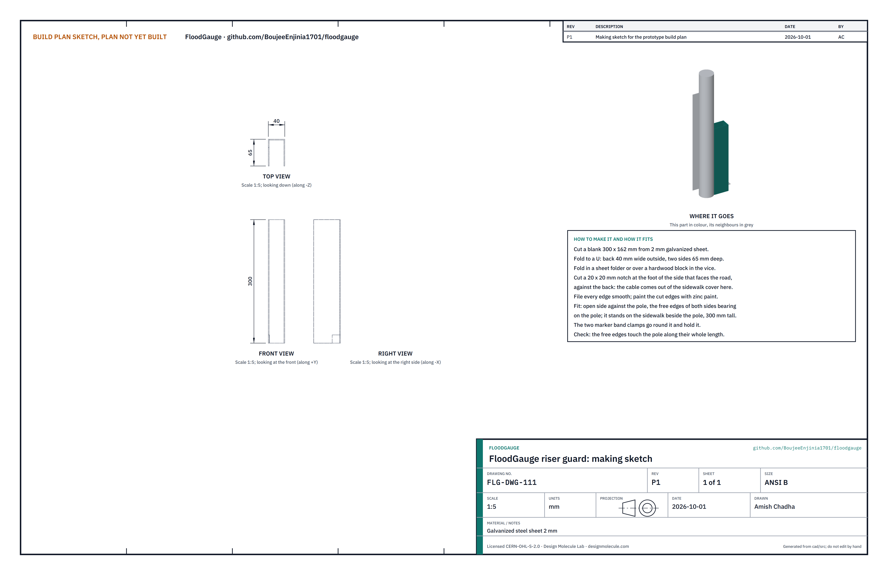

*Figure 18. Riser guard making sketch (FLG-DWG-111).*

**What it is and what it is made from.** A steel channel that protects the drain cable where it rises from the sidewalk to above kicking height. Galvanized steel sheet 2 mm.

**How to make it.**

1. Cut a 300 x 162 blank.
2. Fold to a U: back 40 wide outside, sides 65 deep, in a sheet folder or over a hardwood block in the vice.
3. Cut a 20 x 20 notch at the foot of the side that will face the road, against the back.
4. File every edge smooth and paint cut edges with zinc paint.

**How it fits the parts next to it.** It stands on the sidewalk beside the pole, open side to the pole, the free edges of both sides bearing on the pole (Figure 17). The marker band clamps, with their security screws, hold it. The cable leaves the sidewalk cover through the notch.

**Check before moving on.** The free edges touch the pole along their whole length.

### 3.12 Stilling tube

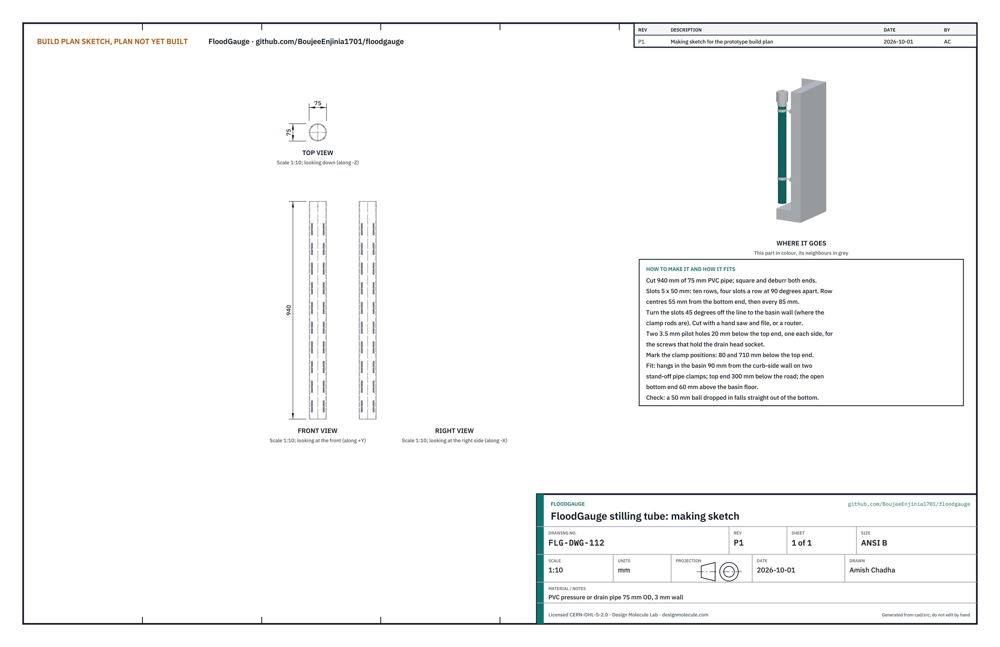

*Figure 19. Stilling tube making sketch (FLG-DWG-112).*

**What it is and what it is made from.** A slotted pipe in the catch basin that calms the water so the drain head reads a steady level. PVC pipe 75 mm outside, 3 mm wall.

**How to make it.**

1. Cut 940; square and deburr both ends.
2. Cut 40 slots 5 x 50: ten rows of four, 90° apart, row centres 55 from the bottom end and then every 85. Turn the slots 45° off the line to the basin wall.
3. Drill two 3.5 mm pilot holes 20 below the top end, one each side, for the drain head screws.
4. Mark the clamp positions 80 and 710 below the top end.

**How it fits the parts next to it.** It hangs 90 from the curb-side wall of the basin on two stand-off pipe clamps (Figure 21), its top 300 below the road and its open bottom 60 above the basin floor.

**Check before moving on.** A 50 mm ball dropped in the top falls out of the bottom.

### 3.13 Drain head

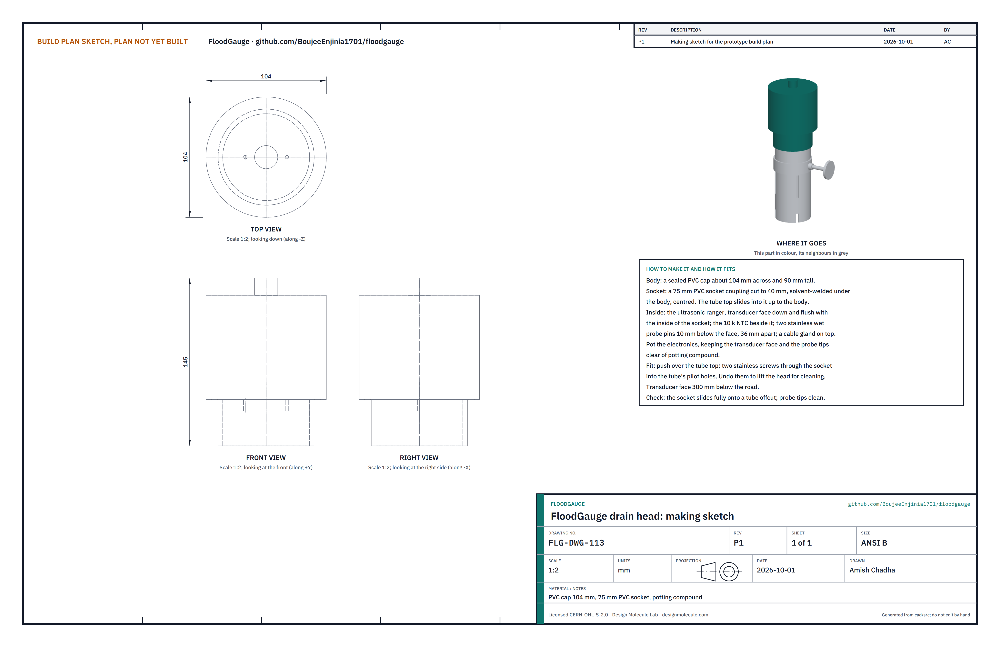

*Figure 20. Drain head making sketch (FLG-DWG-113).*

**What it is and what it is made from.** The ultrasonic ranger, temperature sensor and wet probe, potted in a sealed cap about 104 across and 90 tall, with a 75 mm PVC socket under it.

**How to make it.**

1. Cut a 75 mm socket coupling to 40 long and solvent-weld it centred under the cap.
2. Fit the ultrasonic ranger with its transducer face down, flush with the inside of the socket; fit the 10 k temperature sensor beside it; fit two stainless wet probe pins 36 apart, their tips 10 below the face; fit a cable gland on top.
3. Wire them to the cable as the module datasheets show, then pot the electronics, keeping the transducer face and probe tips clean.

**How it fits the parts next to it.**

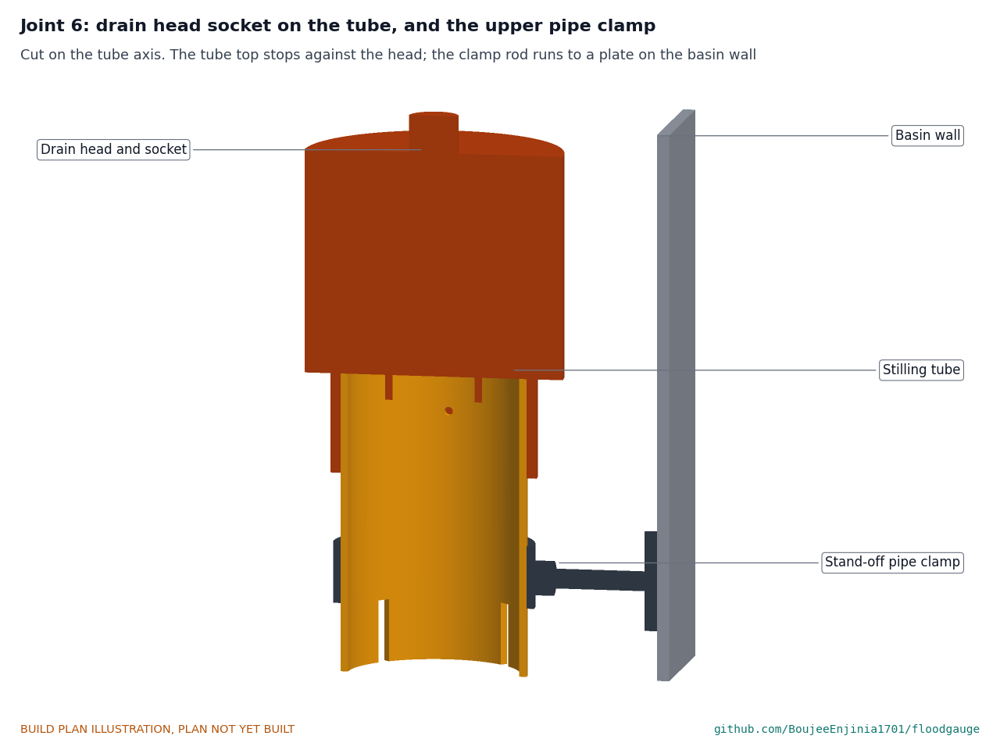

*Figure 21. Cut through the tube: the tube top slides into the socket up to the head; the clamp ring holds the tube on a rod to a plate on the basin wall.*

Pushed over the tube top and held by two stainless screws into the pilot holes. The transducer face is 300 below the road.

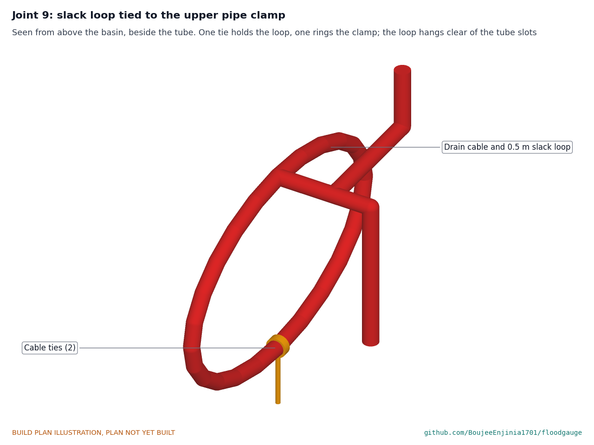

*Figure 22. Seen from above the basin: the drain cable leaves the head, makes a 0.5 m loop beside the tube, and is tied to the loop and to the upper pipe clamp.*

**Check before moving on.** The socket slides fully onto a tube offcut and the probe tips are clean.

### 3.14 Gutter cover

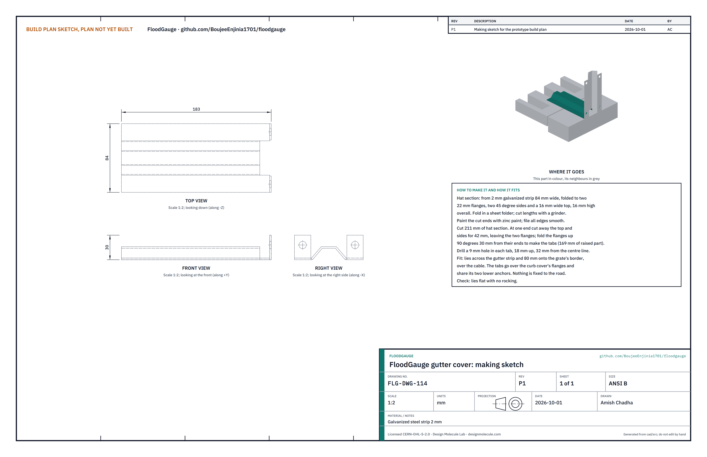

*Figure 23. Gutter cover making sketch (FLG-DWG-114).*

**What it is and what it is made from.** The first of three steel covers over the drain cable: it lies across the gutter strip. All three are a hat section folded from 2 mm galvanized strip 84 wide: two 22 flanges, two 45° sides and a 16 wide top, 16 high overall.

**How to make it.**

1. Fold the hat section in a sheet folder; cut 211 long.
2. At one end cut away the top and sides for 42, leaving the flanges; fold the flanges up 90° 30 from their ends to make two tabs.
3. Drill a 9 mm hole in each tab, 18 up, 32 from the centre line. Paint cut edges with zinc paint.

**How it fits the parts next to it.** It lies over the cable across the gutter strip and 80 onto the grate's border; nothing is fixed to the road. Its tabs lie on the curb cover's flanges and share its two lower anchors (Figure 25).

**Check before moving on.** It lies flat without rocking.

### 3.15 Curb cover

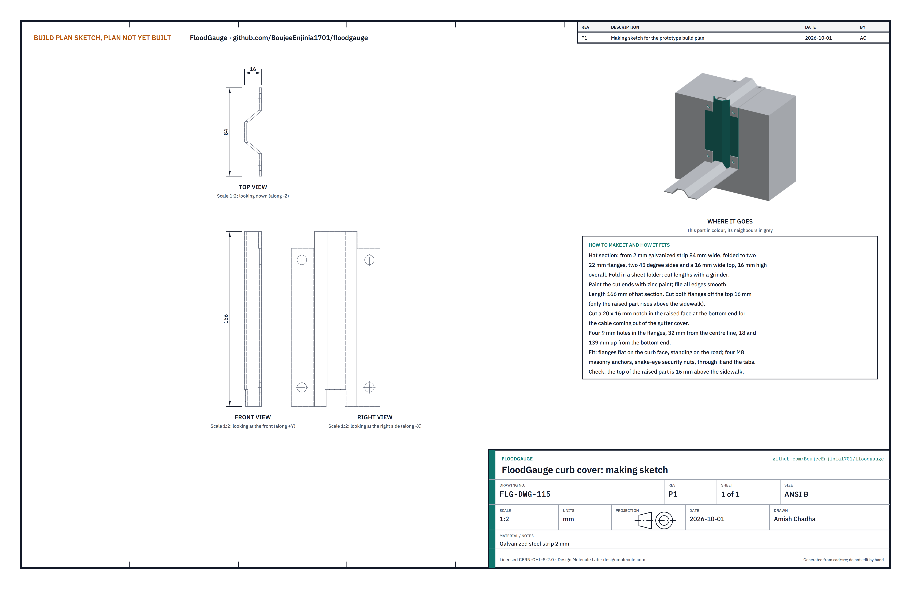

*Figure 24. Curb cover making sketch (FLG-DWG-115).*

**What it is and what it is made from.** The hat-section cover up the curb face.

**How to make it.**

1. Cut 166 of hat section. Cut both flanges off the top 16 (only the raised part rises above the sidewalk).
2. Cut a 20 x 16 notch in the raised face at the bottom end for the cable.
3. Four 9 mm holes in the flanges, 32 from the centre line, 18 and 139 up from the bottom end.

**How it fits the parts next to it.**

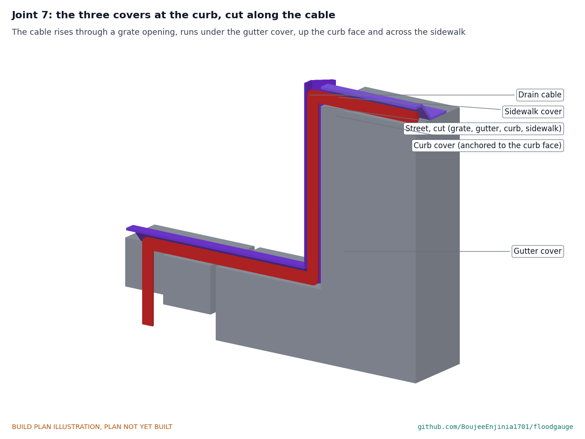

*Figure 25. Cut along the cable: it rises through a grate opening, runs under the gutter cover, up inside the curb cover and across under the sidewalk cover.*

It stands on the road with its flanges flat on the curb face, held by four M8 masonry anchors; the lower two also hold the gutter cover's tabs, the upper two the sidewalk cover's tabs. Each anchor takes a washer and a snake-eye (two-hole) security nut, tightened with the snake-eye spanner bit.

**Check before moving on.** The top of the raised part is 16 above the sidewalk.

### 3.16 Sidewalk cover

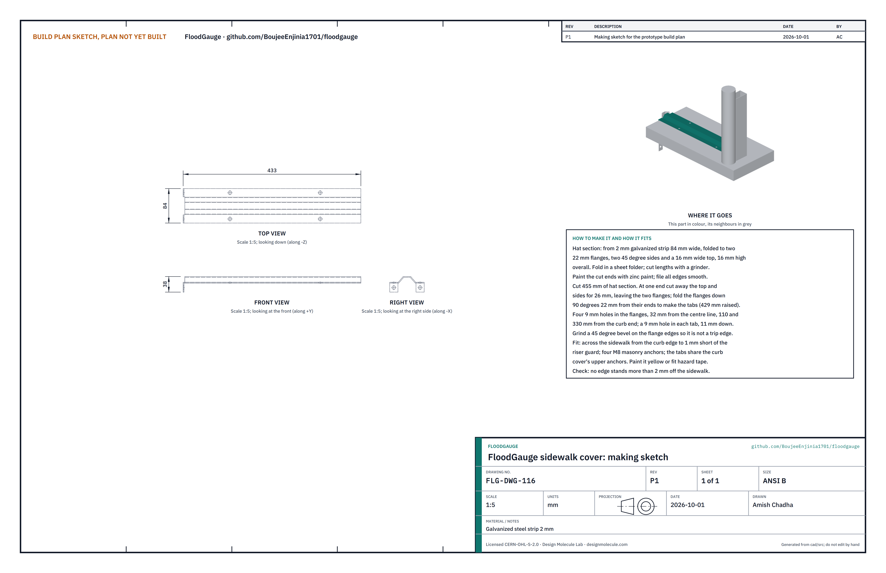

*Figure 26. Sidewalk cover making sketch (FLG-DWG-116).*

**What it is and what it is made from.** The hat-section cover across the sidewalk to the riser guard.

**How to make it.**

1. Cut 455 of hat section. At one end cut away the top and sides for 26, leaving the flanges; fold the flanges down 90° 22 from their ends to make two tabs.
2. Four 9 mm holes in the flanges, 32 from the centre line, 110 and 330 from the curb end; a 9 mm hole in each tab 11 down.
3. Grind a 45° bevel on the flange edges. Paint it yellow or fit hazard tape.

**How it fits the parts next to it.** It runs from the curb edge to 1 short of the riser guard, with the cable entering the guard through its notch. Four M8 masonry anchors in the sidewalk, each with a washer and a snake-eye security nut; its tabs share the curb cover's upper anchors (Figure 25).

**Check before moving on.** No edge stands more than 2 off the sidewalk.

### 3.17 Bought components

Buy to specification, not brand. Line numbers are those of the bill of materials.

- **FieldNode core (line 1).** Built to the FieldNode build plan FND-BLD-001, with band clamps long enough for a 60 mm pole (about 330 to 380 mm round).
- **Radar module, housing, lens stock and gland (line 2).** A 60 GHz pulsed coherent radar module of the Acconeer XM125 class with I2C; a round IP67 housing about 76 x 84 with four lid bosses; PTFE rod or disc 60 x 6; an M12 cable gland for 8 to 10 mm cable.
- **Bracket hardware (line 3).** Two 12 mm stainless worm-drive band clamps for a 60 mm pole with the V-block inside (about 330 to 380 mm round); an M8 x 100 A4 bolt with nyloc nut and two washers; about 14 M6 A4 bolts and nyloc nuts (button-head for the clips); 6 mm aluminium crush sleeves; eight M4 countersunk screws; a 40 mm plastic tube end cap.
- **Drain head parts (line 4).** A waterproof ultrasonic ranger (DFRobot A02YYUW or equal: 3 to 450 cm, IP67, UART); a 10 k temperature sensor; stainless wire for the probe pins; potting compound; a sealed cap about 104 across; a 75 mm PVC socket coupling; two stainless screws.
- **Pipe clamps (line 5).** Two stainless stand-off pipe clamps for 75 mm pipe with an M8 rod about 45 long, a wall plate and a stainless wall anchor.
- **Cables (line 6).** Outdoor 5-core cable about 10 mm with an M12 5-pin plug: 3 m for the street head, 5 m for the drain head.
- **Cover hardware (line 7).** Eight M8 stainless masonry anchors with washers and snake-eye (two-hole) security nuts in place of ordinary nuts; UV-stable cable ties.
- **Marker band clamps (line 8).** Two 12 mm stainless worm-drive band clamps about 450 mm round, with their screws replaced by pin-Torx TR25 security screws.
- **Security fixing bits (line 10).** One snake-eye spanner bit for the security nuts and one TR25 pin-Torx bit for the band clamp screws.

## 4. Putting it together

In each picture the parts already fitted are grey and the part being fitted is in colour, with an arrow showing the way it goes in. Steps 1 to 6 are done on the bench; steps 7 to 14 at the site.

### Step 1: V-blocks onto the bracket plate

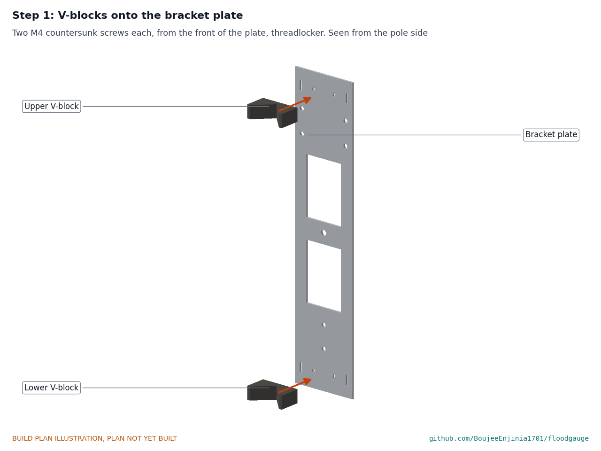

Two M4 countersunk screws per block from the front of the plate, medium threadlocker, snug. The V faces away from the plate.

### Step 2: cleats and foot clip onto the plate

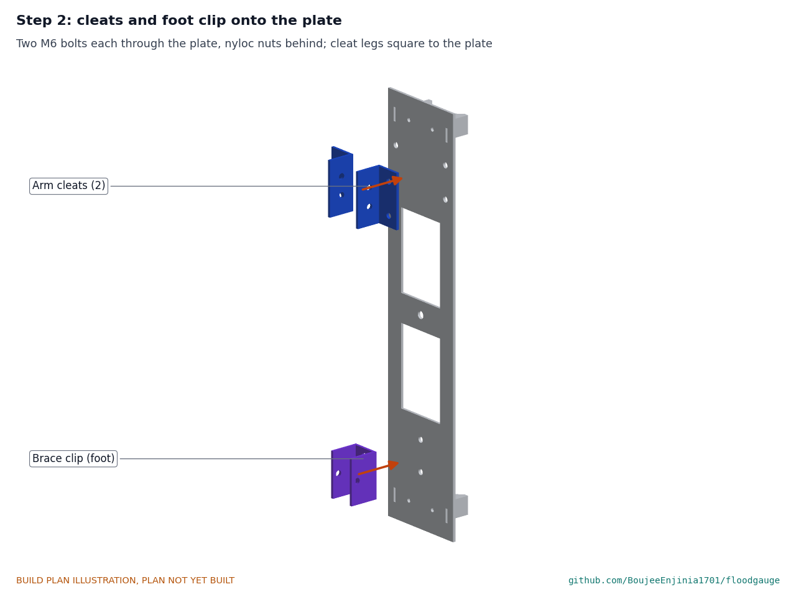

Two M6 bolts per cleat and two M6 button-head bolts in the clip, all through the plate, nyloc nuts behind. The cleats' arm legs stand 40 apart and square to the plate; the clip's ears point toward the road.

### Step 3: head plate and top clip under the arm

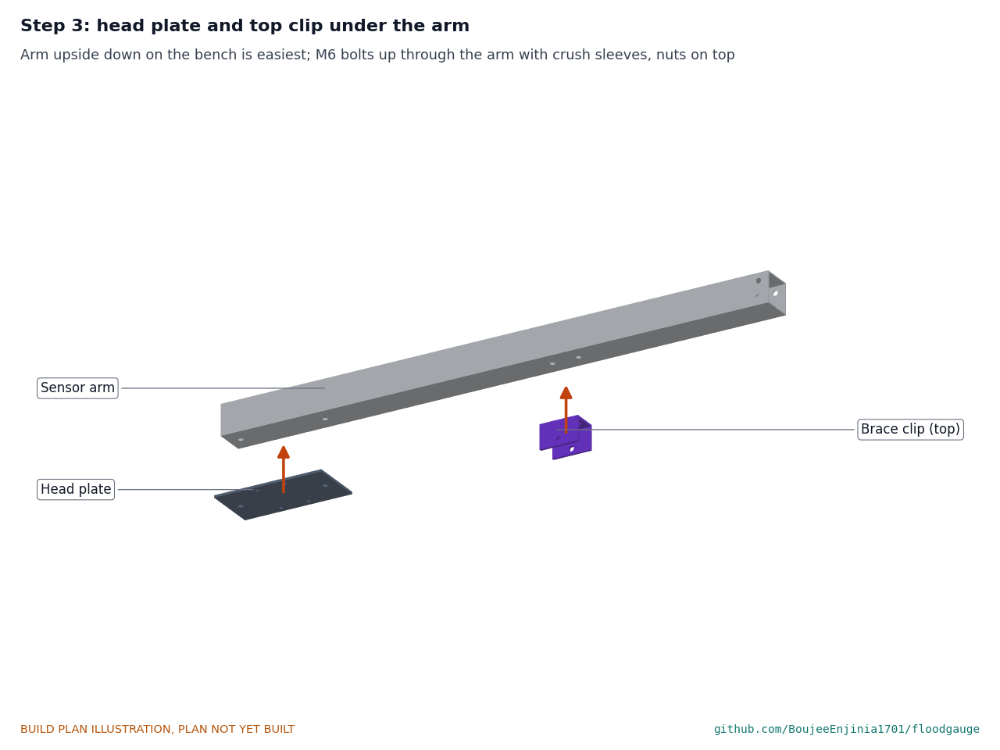

With the arm upside down on the bench, fit crush sleeves and two M6 bolts through each. Nuts on the arm's top face.

### Step 4: radar head onto the head plate

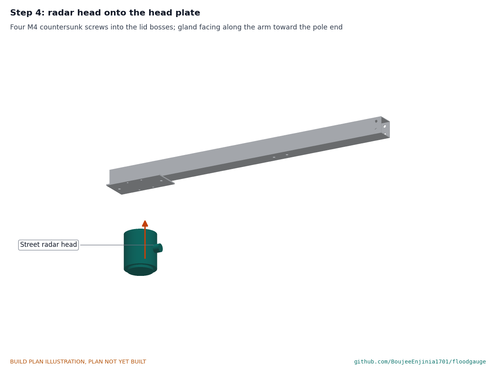

Four M4 countersunk screws into the housing's lid bosses, the gland facing along the arm toward the pole end.

### Step 5: arm between the cleats

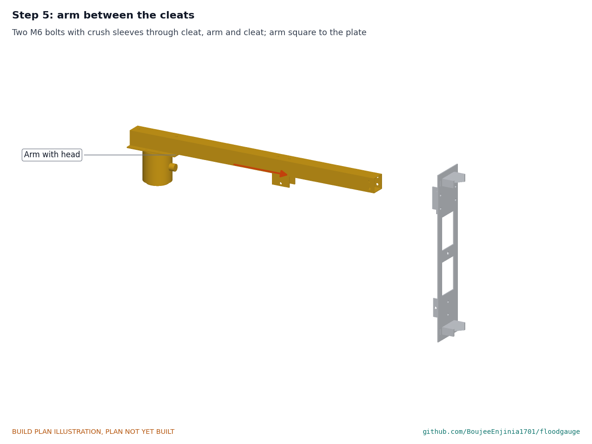

Slide the arm between the cleats until it is 2 short of the plate; two M6 bolts with crush sleeves through cleat, arm and cleat. Check the arm is square to the plate.

### Step 6: knee brace into its clips

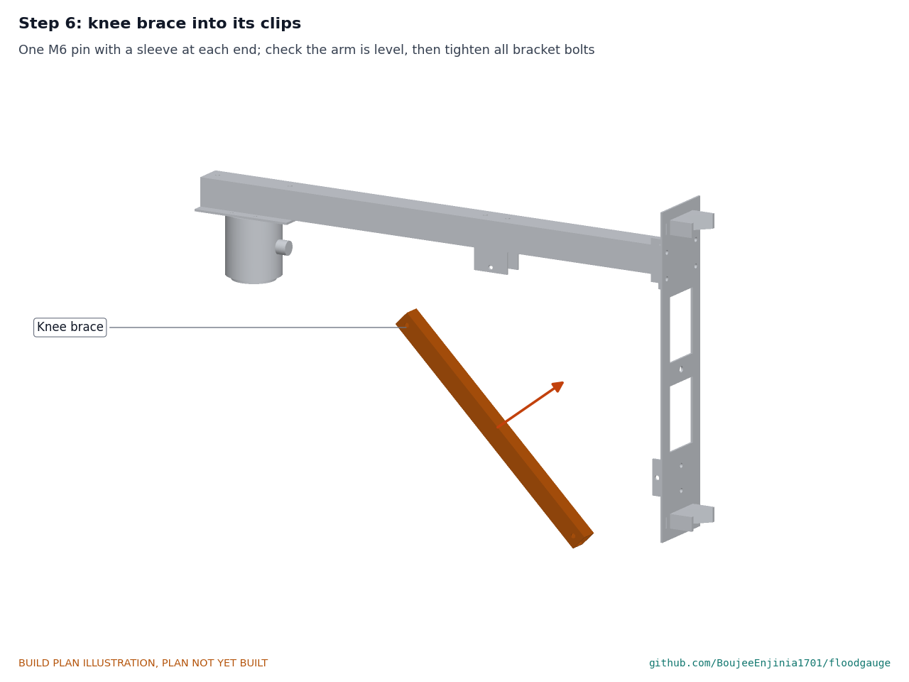

One M6 pin with a sleeve at each end. Set the arm level, then tighten every bracket bolt. **Hold point:** the assembled arm and bracket weigh about 1.7 kg; check every nut is tight before it goes up the pole.

### Step 7: FieldNode onto the pole

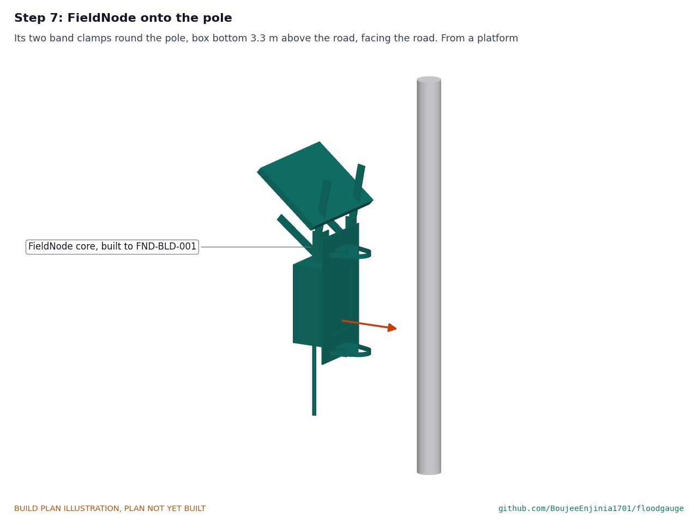

Build the FieldNode to its own plan, then from the platform fit it on the road face of the pole with its own two band clamps, the box bottom 3.3 m above the road and the lid facing the road. **Hold point:** the FieldNode plan's safety stops before its cell goes in.

### Step 8: arm and bracket onto the pole

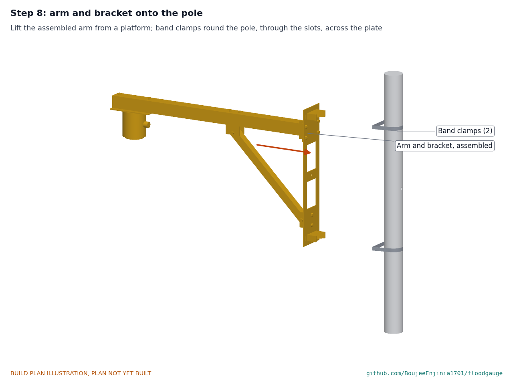

From the platform, with a helper, hold the bracket on the road face of the pole with the arm square to the curb, the lens 4,600 above the road. Pass each band clamp round the pole, through its two slots and across the plate front; tighten to the torque that gives 1,000 N.

### Step 9: anti-rotation through-bolt

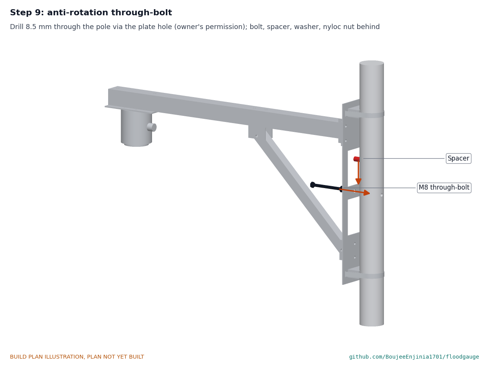

With the owner's permission, drill 8.5 mm through both walls of the pole, using the plate's centre hole as a guide. Bolt from the front through the plate, the spacer and the pole; washer and nyloc nut behind.

### Step 10: street cable to FieldNode port A

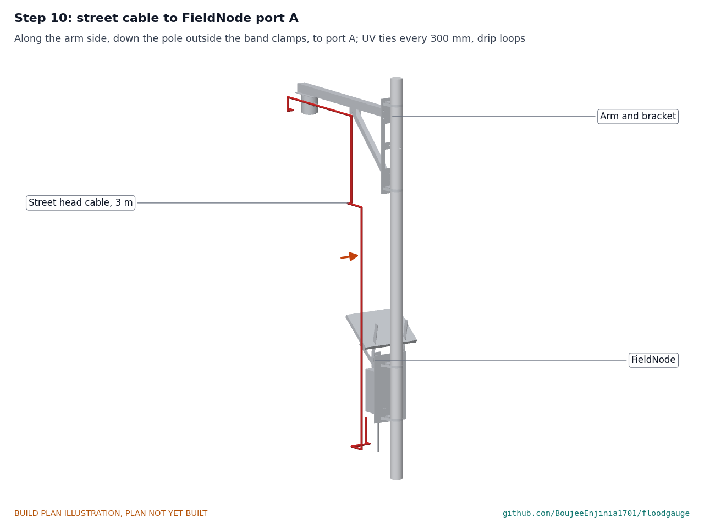

From the head's gland along the side of the arm, down beside the bracket plate, down the side of the pole outside the band clamps, round under the FieldNode box to port A. UV ties every 300 mm and a drip loop below each connector.

### Step 11: depth marker and riser guard onto the pole

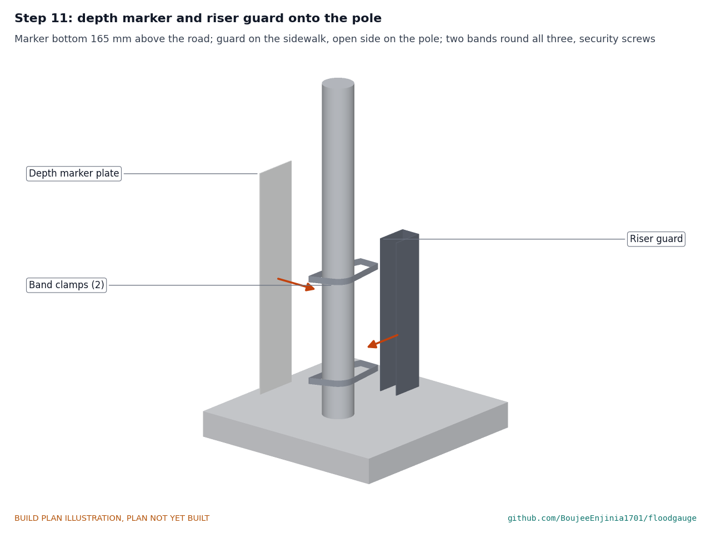

Stand the riser guard on the sidewalk beside the pole, open side to the pole, notch toward the road. Hold the marker plate on the road face with its bottom edge 165 above the road (check with a level from the road at the gutter). Two band clamps at 220 and 420 above the road round all three; close each clamp with its security screw and the pin-Torx bit.

### Step 12: pipe clamps and stilling tube into the basin

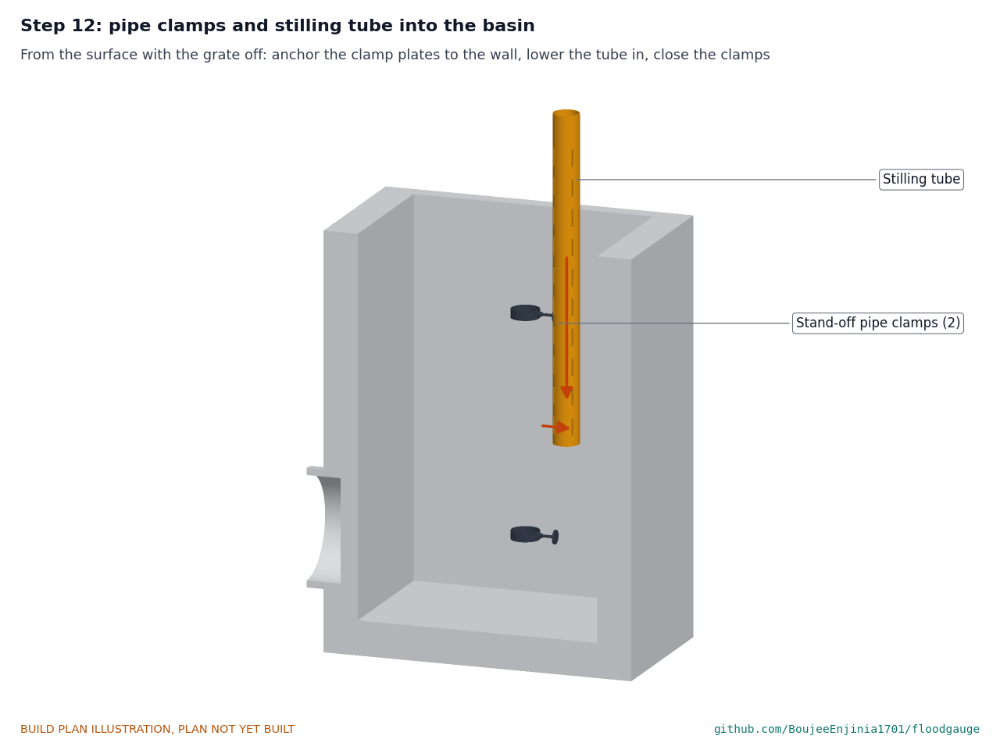

From the surface, with the grate lifted by two people with a grate hook: fit the two wall anchors and clamp plates 80 and 710 below the planned tube top, using an extension drill through the opening. Lower the tube in, close the clamps round it with its top 300 below the road. **Hold point:** safety stop S3.

### Step 13: drain head onto the tube

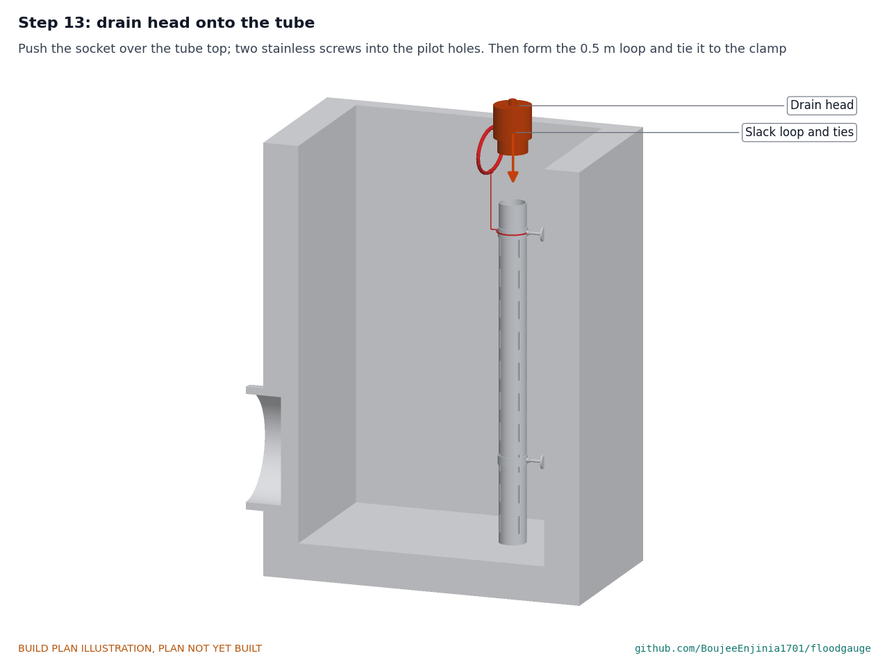

Push the socket fully over the tube top; two stainless screws into the pilot holes. Then take the drain cable from the head and make a 0.5 m slack loop, hanging beside the tube on the side away from the slots, below the grate opening. Tie the loop with one cable tie and tie it to the upper pipe clamp with a second, so the cable cannot swing into the tube or catch debris (Figure 22).

### Step 14: drain cable and the three covers

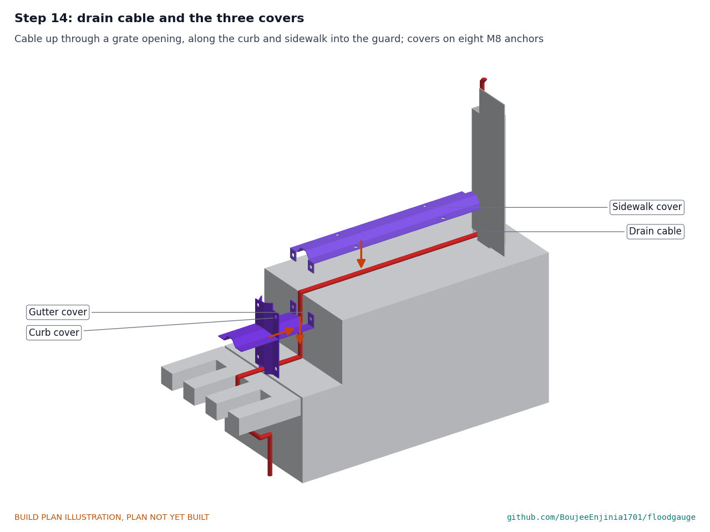

Leave the 0.5 m slack loop from step 13 hanging in the basin, tied to the clamp. Bring the cable up through the grate opening nearest the curb on the cover line, close the grate, lay the cable across the gutter strip and up the curb face and across the sidewalk into the riser guard and up the pole to port B. Fit the curb cover on four anchors (the lower two also through the gutter cover's tabs, the upper two through the sidewalk cover's tabs) and the sidewalk cover on four more, each anchor with a washer and a snake-eye security nut. **Hold point:** safety stop S4.

### Lifting the grate for cleaning

After the pilot is built, the grate is lifted for cleaning in this order, with two people, a grate hook and the open inlet guarded (safety stop S3).

1. Undo the two anchor nuts that hold the gutter cover's tabs, using the snake-eye spanner bit, and lift the gutter cover off the grate border.
2. Leave the drain cable in place; it stays threaded through the grate opening, and the 0.5 m slack loop in the basin gives it the length it needs.
3. Lift the grate with the hook and rest it clear of the opening, taking care not to pull on the cable. Nobody puts their head or body into the basin.
4. Clean the grate and the surface by hand from above. Check from above that the loop is still tied to the pipe clamp and hangs clear of the tube.
5. Set the grate back so it sits fully on its frame, refit the gutter cover and tighten both security nuts. This sequence is reviewed after the first cleaning visit.

## 5. First checks

These are the checks a TRL 4 test report would record; this plan only lists them. Requirement numbers are those of FLG-REQ-001.

*Table 2. First checks.*

| Check | Requirement | How | Pass when |
| --- | --- | --- | --- |
| Lens height | R1, R13 | Tape and level from the road surface below the head; record the dry-road radar reading | 4,600 mm, give or take 5 mm; the two agree within 5 mm |
| Arm level and square | R1 | Level on the arm; tape from the curb face to the head axis | Level within 1°; head axis 250 mm past the curb face, give or take 10 mm |
| Arm does not turn | R15 | Push the head sideways by hand with about 50 N | No movement at the bracket |
| Mass on the pole | R15 | Weigh each assembly before it goes up | 5.0 kg or less in all (4.99 kg estimated) |
| Street depth on a target | R2 | Hold a flat board level at 150 and 300 mm above the road under the head | Reads within 10 mm |
| Drain level on a target | R3, R4 | Lower a float plate in the tube to 3 levels with the head lifted onto a test stand | Reads within 20 mm |
| Wet probe | R3 | Wet the probe pins | Drain-full signal |
| Cable covers | R12 | Walk and step on the sidewalk cover; run a hand along every edge | No edge more than 2 mm proud; nothing moves |
| Installation time | R12 | Time the site steps with a two-person crew | 120 min or less on the pilot surface route (120 min estimated) |

## 6. Safety stops

Stop at each point. Carry on only when everything listed is true.

- **S1. Before any site work.** Permission from the pole and road owner; traffic and pedestrian management in place; the platform inspected; overhead lines located and clear by the owner's distance; a second person present.
- **S2. Before drilling the pole.** Written permission to drill it; the pole is not live (no internal wiring at the drill height); eye protection.
- **S3. Before lifting the grate.** Two people and a grate hook; the open inlet guarded; nobody puts their head or body into the basin; gloves and eye protection for stormwater; no work in rain or with water flowing.
- **S4. Before leaving the site.** Every band clamp, bolt and anchor nut tight; the grate seated; the sidewalk cover flat and marked; the FieldNode's own safety stops passed; the gauge reporting to the alert service.
- **S5. Lithium cell.** The FieldNode's cell rules apply in full (fused, charged only between 0 and 45 °C, never a swollen or wet cell).

## 7. Tools, skills and workspace

**Tools.** Hacksaw or bandsaw; bench vice with soft jaws; bench drill or drill stand; drills 3 to 10 mm and an 8.5 mm long-series drill; 46 mm hole saw; countersink; M4 tap and tap drill; jigsaw with metal blade; files; deburring tool; scriber, square, 45° square, steel rule and calipers; sheet folder (or hardwood blocks in the vice) for 2 and 3 mm sheet up to 100 wide; angle grinder with cutting disc; hammer drill and 8 mm masonry bit with an extension; torque wrench; spirit level and 5 m tape; grate hook; a snake-eye spanner bit (for the security nuts on the cover anchors) and a TR25 pin-Torx bit (for the marker band clamp screws); soldering iron, crimper and multimeter for the heads; PVC cement.

**Skills.** No certified trade for the workshop part: marking out, sawing, drilling, filing, tapping, folding sheet, light soldering and potting. Site work needs people trained for work beside traffic and on a mobile elevating platform, as local rules require.

**Workspace.** A bench about 1.5 x 0.6 m with a vice; a ventilated corner for PVC cement and potting; at the site, the traffic-managed area round the pole and the inlet.

**Personal protective equipment.** Safety glasses, cut-resistant gloves, hearing protection when cutting; at the site high-visibility clothing, a helmet, a harness on the platform, and waterproof gloves near stormwater.

## 8. Where the numbers come from

- Model and constructability checks: `cad/src/model.py` (`python cad/src/model.py --check`, 110 checks); STEP and STL exports in `cad/step/` and `cad/stl/`.
- Pictures: `cad/src/build_plan_media.py`, using `.kit/build_views.py`; written to `docs/05-build-plan/` and `cad/drawings/FLG-DWG-101` to `FLG-DWG-116`.
- General arrangement: `cad/drawings/FLG-DWG-001.pdf`, Rev P4.
- Calculations: `docs/04-calcs/01-sizing.md` (FLG-CAL-001 v0.4) and `docs/04-calcs/sizing.py`; arm and bracket [H1] to [H5], mass [I1], [I2], cables [J1], [J2].
- Bill of materials: `bom/bom.csv`.
- Decisions: `docs/decisions/0003-design-for-construction.md` (FLG-DDR-003), with FLG-DDR-001 and FLG-DDR-002; register `docs/06-design-decisions.md` (FLG-DEC-001).
- Requirements: `docs/03-requirements.md` (FLG-REQ-001 v0.6).
- FieldNode: the FieldNode repo's build plan FND-BLD-001.
